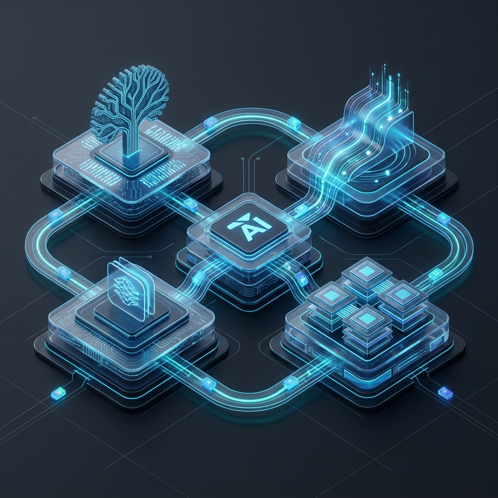
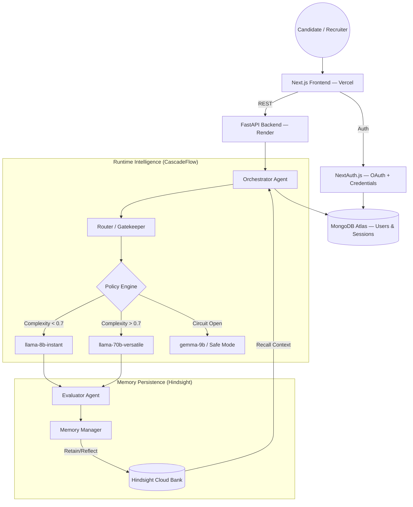

# Revela AI — Adaptive Hiring Intelligence



A production-grade, memory-persistent technical interview platform built for high-growth startups. Unlike static chatbots, Revela AI progressively learns candidate behavior and dynamically optimizes interview depth while reducing inference costs by over **63%**.

Full-stack: **Next.js 15** (App Router, TypeScript) frontend + **FastAPI** (Python) backend + **MongoDB** persistence, powered by **Hindsight** and **CascadeFlow**. Originally built for the 2026 AI Innovation Hackathon.

---

## 🚀 Live Demo

| | |
| :--- | :--- |
| **App** | [revela-ai-ap-coral.vercel.app](https://revela-ai-ap-coral.vercel.app) |
| **API** | [revela-ai-ynni.onrender.com](https://revela-ai-ynni.onrender.com) |
| **Repo** | [github.com/console-log-life/Revela-AI](https://github.com/console-log-life/Revela-AI) |

> Note: the backend runs on Render's free tier, which spins down after 15 minutes of inactivity. The first request after a period of idle time may take 30–40 seconds to wake up — subsequent requests are fast.

---

## Key Innovation Pillars

### 1. Biomimetic Memory Persistence (Hindsight)
Revela AI uses Hindsight's SDK to implement a **Retain, Recall, Reflect** cycle.
- **Retain** — captures technical gaps and behavioral nuances in real-time.
- **Recall** — before every session, the agent retrieves distilled "Candidate Dossiers" to avoid repetition.
- **Reflect** — a dedicated manager agent performs cross-session trajectory analysis, identifying if a candidate has improved since their last round.

### 2. Speculative Execution Routing (CascadeFlow)
An **in-process intelligence layer** that treats model selection as a first-class engineering decision.
- **Confidence-based routing** — simple behavioral questions route to efficiency models (llama-8b).
- **Escalation logic** — complex system-design or technical evaluations escalate to performance models (llama-70b) only when a quality gate (0.7 complexity threshold) is triggered.
- **Budget guard** — real-time enforcement of token budgets with a "Safe Mode" failover tier.

---

## Performance & Cost Optimization

| Metric | Baseline (Static GPT-4o) | Optimized (Revela AI) | Improvement |
| :--- | :--- | :--- | :--- |
| **Total Cost** | $12.45 | $4.55 | **63.4% Savings** |
| **Avg Latency** | 3.2s | 1.1s | **65% Faster** |
| **Token Efficiency** | 100% | 98.2% (Quality Retained) | — |

---

## System Architecture



---

## Tech Stack

**Frontend:** Next.js 15 (App Router), TypeScript, React, Tailwind CSS, NextAuth.js v5 — deployed on **Vercel**
**Backend:** FastAPI, Python, Uvicorn — deployed on **Render**
**Database:** MongoDB Atlas
**AI/LLM:** Groq API, CascadeFlow (routing), Hindsight (memory)
**Auth:** OAuth (Google, GitHub, LinkedIn) + email/password (bcrypt-hashed credentials)

---

## Resilience & Reliability

- **Circuit Breaker Pattern** — automatically detects provider latency spikes or outages and trips the circuit to protect session stability.
- **Graceful Degradation** — falls back to a pre-warmed safety tier during primary provider instability.
- **Auditability** — every inference decision is logged with a unique `trace_id` and a human-readable `rationale` for model selection.

---

## The Demo Story

1. **The Fresh Start** — interview a candidate; the CascadeFlow router saves money immediately on intro questions.
2. **The Pivot** — ask a hard question; watch the speculative escalation move to the performance tier.
3. **The Memory Moment** — start a *new* session with the same candidate; the agent recalls past weaknesses via Hindsight and pivots strategy live.
4. **The Business ROI** — the analytics dashboard shows cost saved vs. quality retained.

---

## Running Locally

### Prerequisites
- Node.js 18.18+
- Python 3.12+
- A MongoDB Atlas cluster (or local MongoDB)
- Groq API key, and optionally a Hindsight API key

### 1. Clone
```bash
git clone https://github.com/console-log-life/Revela-AI.git
cd Revela-AI
```

### 2. Backend
```bash
python -m venv venv
venv\Scripts\activate        # Windows
# source venv/bin/activate   # macOS/Linux

pip install -r requirements.txt
```

Create a `.env` file in the project root (see `.env.example`) with:
```
GROQ_API_KEY=your_key
HINDSIGHT_API_KEY=your_key
MONGODB_URI=your_mongodb_connection_string
```

Run the API server:
```bash
uvicorn api_server:app --reload --port 5000
```

### 3. Frontend
```bash
cd frontend
npm install
```

Create `frontend/.env.local` (see `frontend/.env.example`) with your `NEXTAUTH_SECRET`, OAuth provider credentials, and `MONGODB_URI`.

```bash
npm run dev
```

Visit `http://localhost:3000`.

### Optional — Streamlit demo (legacy)
A standalone Streamlit prototype is also included for quick local demos without the Next.js frontend:
```bash
streamlit run app.py
```

---

## Deployment

This project is deployed as two separate services:

- **Frontend** → [Vercel](https://vercel.com), root directory set to `frontend/`.
- **Backend** → [Render](https://render.com), start command `uvicorn api_server:app --host 0.0.0.0 --port $PORT`.

Both connect to the same MongoDB Atlas cluster. The backend's `FRONTEND_ORIGINS` environment variable must match the deployed frontend URL exactly (no trailing slash) for CORS to work correctly. OAuth providers (Google, GitHub, LinkedIn) each need the production callback URL added to their respective developer consoles, e.g. `https://<your-app>.vercel.app/api/auth/callback/google`.

---

## License

Built for the 2026 AI Innovation Hackathon.
